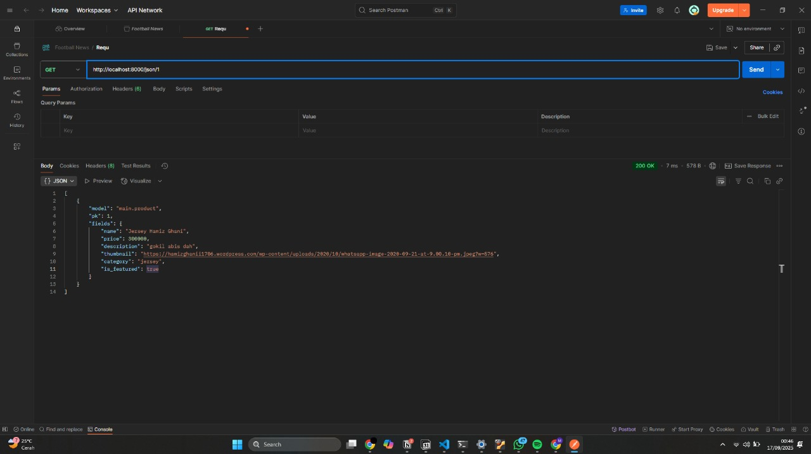
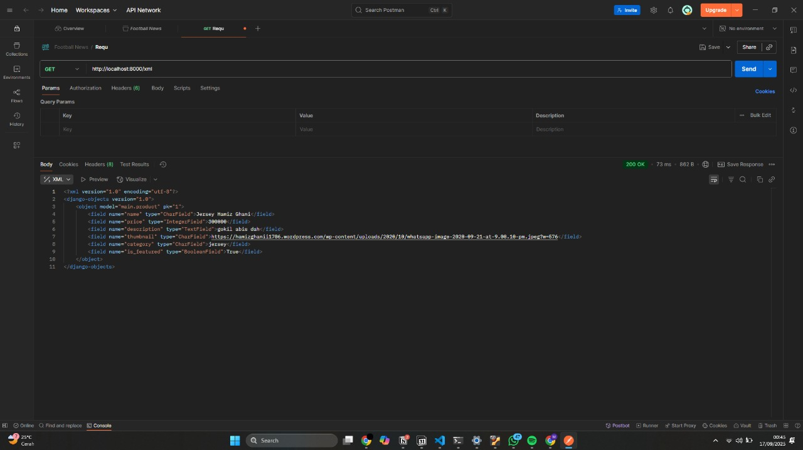

🌐 Link Aplikasi
https://muhammad-hamiz-adibosstore.pbp.cs.ui.ac.id/ 

**TUGAS 2**

A. Step-by-Step Pengerjaan Checklist

1. Membuat proyek Django baru dengan django-admin startproject adibos_store lalu masuk ke direktori proyek.
2. Membuat aplikasi main dengan python manage.py startapp main.
3. Registrasi aplikasi ke INSTALLED_APPS pada settings.py.
4. Membuat model Product pada main/models.py dengan atribut sesuai permintaan
5. Migrasi database dengan makemigrations dan migrate.
6. Membuat view di views.py yang menampilkan nama aplikasi, nama, dan kelas.
7. Membuat routing urls.py di aplikasi main untuk memetakan fungsi
8. Menghubungkan routing aplikasi main ke urls.py proyek utama.
9. Deployment ke PWS agar aplikasi dapat diakses publik.

B. Buatlah bagan yang berisi request client ke web aplikasi berbasis Django beserta responnya dan jelaskan pada bagan tersebut kaitan antara urls.py, views.py, models.py, dan berkas html.

1. Client Browser
Mengirim request ke server (contoh: http://localhost:8000/main/).

2. urls.py
Menerima request dari client, Mencocokkan pola URL dengan fungsi di views.py.

3. views.py
Berisi logika aplikasi, Bisa memanggil models.py jika butuh data dari database, Menyiapkan context data untuk dikirim ke template.

4. models.py
Merepresentasikan tabel database dalam bentuk class Python,Mengelola CRUD (Create, Read, Update, Delete) data.

5. Template HTML
Menerima context dari view, Menghasilkan tampilan yang akan dikirim kembali ke client

6. Response ke Client
Browser menerima file HTML hasil render untuk ditampilkan ke pengguna.

C. Jelaskan peran settings.py dalam proyek Django!!

settings.py adalah pusat konfigurasi pada proyek Django. Semua pengaturan inti yang dibutuhkan aplikasi ada di sini, meliputi:

INSTALLED_APPS → daftar aplikasi yang aktif pada proyek.
DATABASES → koneksi dan jenis database (SQLite, PostgreSQL, dll).
MIDDLEWARE → lapisan pemrosesan request/response (misalnya keamanan, autentikasi).
TEMPLATES → konfigurasi template HTML.
STATIC & MEDIA FILES → pengaturan file statis (CSS, JS, gambar).
SECRET_KEY & DEBUG → keamanan dan mode debugging.

👉 Dengan kata lain, settings.py berfungsi seperti “control center” yang mengatur jalannya proyek.

D. Bagaimana cara kerja migrasi database di Django?
Migrasi adalah cara Django menyelaraskan struktur database dengan model Python.

Langkah 1: makemigrations
Django membaca perubahan pada models.py dan membuat file migrasi (semacam “script perubahan database”).
Langkah 2: migrate
File migrasi tersebut dijalankan ke database → menciptakan tabel baru, mengubah kolom, atau menambahkan constraint sesuai model.

👉 Migrasi memastikan database dan kode selalu sinkron, sehingga tidak perlu menulis query SQL manual.

E. Menurut Anda, dari semua framework yang ada, mengapa framework Django dijadikan permulaan pembelajaran pengembangan perangkat lunak?

1. Struktur jelas & modular → memakai konsep MVT (Model-View-Template) yang mudah dipahami pemula.
2. Banyak fitur bawaan (batteries included) → ORM, admin panel, autentikasi sudah tersedia.
3. Best practice bawaan → Django mendorong cara coding yang rapi, aman, dan scalable.
4. Dokumentasi lengkap & komunitas besar → mendukung pembelajaran mandiri.

👉 Jadi, Django memperkenalkan mahasiswa pada fundamental software engineering sekaligus praktik nyata industri.

F. Apakah ada feedback untuk asisten dosen tutorial 1 yang telah kamu kerjakan sebelumnya?

Tidak ada, sangat salut untuk tim asisten dosen terutama asdos saya juga kak nevin dan teman-teman asdos lainnya yang sangat semangat dan bertanggung jawab dalam memberikan penjelasan

**TUGAS 3**
*Mengapa kita memerlukan data delivery dalam pengimplementasian sebuah platform?*

Data delivery diperlukan agar data dapat dipertukarkan antar komponen sistem maupun antara server dengan client. Misalnya, aplikasi web membutuhkan cara untuk mengirim data dari server (database) ke browser user. Tanpa mekanisme data delivery, platform tidak bisa menampilkan data dinamis, melakukan interaksi real-time, atau bertukar informasi dengan aplikasi lain (misalnya API).

*Mana yang lebih baik antara XML dan JSON? Mengapa JSON lebih populer dibandingkan XML?*

Secara umum, JSON lebih baik untuk aplikasi web modern karena:
1. Lebih ringkas dan mudah dibaca.
2. Didukung langsung oleh JavaScript (native).
3. Parsing lebih cepat dibanding XML.

Sementara XML lebih cocok untuk data yang sangat kompleks dengan kebutuhan skema dan validasi formal.
JSON lebih populer karena lebih sederhana, efisien, dan terintegrasi baik dengan ekosistem web saat ini.

*Fungsi dari method is_valid() pada form Django dan mengapa kita membutuhkannya?*

Method is_valid() digunakan untuk memvalidasi data yang dikirim melalui form. Fungsi ini akan memeriksa apakah data sesuai dengan aturan yang sudah didefinisikan di forms.py atau di model (misalnya panjang field, tipe data, required field).
Kita membutuhkannya agar data yang tersimpan di database konsisten, valid, dan aman dari input yang tidak sesuai.

*Mengapa kita membutuhkan csrf_token saat membuat form di Django? Apa yang dapat terjadi jika kita tidak menambahkannya?*

csrf_token digunakan untuk mencegah serangan Cross-Site Request Forgery (CSRF). Token ini memastikan bahwa request POST benar-benar berasal dari user yang sedang login di situs kita, bukan dari situs lain yang mencoba mengirim request palsu.
Jika tidak ditambahkan, penyerang bisa memanfaatkan celah ini untuk membuat user tanpa sadar mengirimkan request berbahaya, misalnya mengubah data, menghapus data, atau melakukan transaksi.

*Jelaskan bagaimana cara kamu mengimplementasikan checklist di atas secara step-by-step.*

1. Menambahkan fungsi views untuk menampilkan data dalam format XML, JSON, serta berdasarkan ID.
2. Membuat routing di urls.py agar setiap view bisa diakses.
3. Membuat template product_list.html untuk menampilkan daftar produk dengan tombol Add dan Detail.
4. Membuat form ProductForm di forms.py untuk menambahkan produk baru.
5. Menambahkan fungsi add_product di views.py serta template product_form.html.
6. Membuat template product_detail.html untuk menampilkan detail tiap produk.
7. Melakukan migrasi database (makemigrations dan migrate).
8. Menambahkan jawaban teori ini ke README.md.
9. Menguji semua URL dengan Postman dan browser.

Hasil Request Postman
# http://localhost:8000/json

# http://localhost:8000/json/1/

# http://localhost:8000/xml

# http://localhost:8000/xml/1/

**TUGAS 4**

*Apa itu Django AuthenticationForm? Jelaskan juga kelebihan dan kekurangannya.*

AuthenticationForm adalah form bawaan Django (di modul django.contrib.auth.forms) yang digunakan untuk memvalidasi kredensial login (biasanya username dan password). Secara internal form ini memanggil fungsi authenticate() untuk memeriksa kredensial dan menyediakan method get_user() untuk mengambil instance user yang berhasil diautentikasi.

Kelebihan
1. Terintegrasi langsung dengan mekanisme autentikasi Django (authenticate(), session backend).
2. Menyediakan handling error dan validasi standar (contoh: user tidak aktif, kredensial salah).
3. Mudah dipakai bersama view login built-in atau custom view.
4. Mengurangi boilerplate (tidak perlu menulis validasi credential manual).

Kekurangan
1. Hanya menangani pola login standar (username + password). Jika ingin login dengan email atau field lain, perlu extend atau buat custom form/backend.
2. Tidak mengurus otorisasi atau permission — hanya autentikasi.
3. Pesan error/aturan validasi generik; untuk tampilan/masukan spesifik sering perlu customisasi.

*Apa perbedaan antara autentikasi dan otorisasi? Bagaiamana Django mengimplementasikan kedua konsep tersebut?*

Autentikasi (Authentication)
Definisi: proses memverifikasi identitas pengguna (siapa dia). Biasanya menggunakan username/password, token, atau metode lain (OAuth, SSO). 
Di Django: authenticate() memeriksa kredensial, login() menyimpan status login ke session. Backends autentikasi (class di AUTHENTICATION_BACKENDS) bertanggung jawab untuk logika verifikasi.

Otorisasi (Authorization)
Definisi: proses menentukan apakah pengguna berhak melakukan aksi tertentu (apa yang boleh dilakukan). Contoh: mengakses halaman admin, mengubah objek A, dll.
Di Django: model permission (per-model permissions), method user.has_perm('app.action_model'), user.is_staff / user.is_superuser, dan group. Django menyediakan decorator/mixins (@permission_required, LoginRequiredMixin, PermissionRequiredMixin) untuk memudahkan pengecekan permission.

*Apa saja kelebihan dan kekurangan session dan cookies dalam konteks menyimpan state di aplikasi web?*

Cookie (client-side)

Kelebihan:
1. Persisten (bisa memiliki masa hidup sendiri → cocok untuk remember-me atau preferensi).
2. Tidak memerlukan penyimpanan server (bebas skalabilitas server).

Kekurangan:

1. Ukuran terbatas (sekitar 4 KB).
2. Rentan terhadap XSS (jika JS dapat membaca cookie) dan pencurian cookie.
3. Data di sisi klien mudah dimanipulasi jika tidak ditandatangani/di-encrypt.
4. Perlu perhatian keamanan (HttpOnly, Secure, SameSite).

Session (server-side, dengan ID dikirim lewat cookie)

Kelebihan:
1. Lebih aman untuk data sensitif karena tidak disimpan di client (hanya id).
2. Dapat menyimpan data lebih besar.
3. Server bisa invalidasi session (logout global, forced logout).

Kekurangan:
1. Membutuhkan sumber daya server (penyimpanan session).
2. Perlu strategi scaling (shared cache/DB) jika aplikasi berjalan multi-instance.
3. Jika session id dicuri, attacker mendapat akses—maka perlunya mitigasi (rotasi session, cookie flags).

*Apakah penggunaan cookies aman secara default dalam pengembangan web, atau apakah ada risiko potensial yang harus diwaspadai? Bagaimana Django menangani hal tersebut?*

Tidak otomatis aman — ada beberapa risiko: XSS (script membaca cookie), CSRF (site yang dipercaya mengirim request atas nama user), cookie theft over plain HTTP.

1. SESSION_COOKIE_HTTPONLY = True (default — mencegah akses cookie via JS).
2. SESSION_COOKIE_SECURE = True (pastikan HTTPS di produksi; mencegah cookie dikirim lewat HTTP).
3. SESSION_COOKIE_SAMESITE = 'Lax' atau 'Strict' (membatasi cookie ter-send pada cross-site requests; 'Lax' umumnya seimbang untuk UX).
4. CSRF protection: middleware CsrfViewMiddleware + CSRF token (csrf_token di template) membantu mencegah CSRF.
5. Saat login() Django melakukan rotasi session key (mengurangi risiko session fixation).

*Jelaskan bagaimana cara kamu mengimplementasikan checklist di atas secara step-by-step (bukan hanya sekadar mengikuti tutorial).*
1. Mengkoneksikan class product ke user dengan "owner = models.ForeignKey(User, on_delete=models.CASCADE, null=True)" kemudian melakukan migrasi dan update pada add_product
2. Membuat template untuk login, register dan logout
3. Menampilkan logged in user dan set cookie untuk last login 
4. Membuat dummy data pada localhost untuk 2 akun

<!-- dummy data
userganteng
g4ntengbanget
usercantik
c4ntikbanget -->