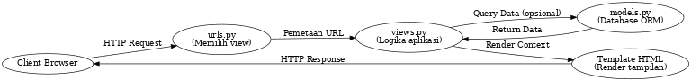

🌐 Link Aplikasi
https://muhammad-hamiz-adibosstore.pbp.cs.ui.ac.id/ 

Step-by-Step Pengerjaan Checklist

1. Membuat proyek Django baru dengan django-admin startproject adibos_store lalu masuk ke direktori proyek.
2. Membuat aplikasi main dengan python manage.py startapp main.
3. Registrasi aplikasi ke INSTALLED_APPS pada settings.py.
4. Membuat model Product pada main/models.py dengan atribut sesuai permintaan
5. Migrasi database dengan makemigrations dan migrate.
6. Membuat view di views.py yang menampilkan nama aplikasi, nama, dan kelas.
7. Membuat routing urls.py di aplikasi main untuk memetakan fungsi
8. Menghubungkan routing aplikasi main ke urls.py proyek utama.
9. Deployment ke PWS agar aplikasi dapat diakses publik.

B. Buatlah bagan yang berisi request client ke web aplikasi berbasis Django beserta responnya dan jelaskan pada bagan tersebut kaitan antara urls.py, views.py, models.py, dan berkas html.

C. Jelaskan peran settings.py dalam proyek Django!!

settings.py adalah pusat konfigurasi pada proyek Django. Semua pengaturan inti yang dibutuhkan aplikasi ada di sini, meliputi:

INSTALLED_APPS → daftar aplikasi yang aktif pada proyek.
DATABASES → koneksi dan jenis database (SQLite, PostgreSQL, dll).
MIDDLEWARE → lapisan pemrosesan request/response (misalnya keamanan, autentikasi).
TEMPLATES → konfigurasi template HTML.
STATIC & MEDIA FILES → pengaturan file statis (CSS, JS, gambar).
SECRET_KEY & DEBUG → keamanan dan mode debugging.

👉 Dengan kata lain, settings.py berfungsi seperti “control center” yang mengatur jalannya proyek.

D. Bagaimana cara kerja migrasi database di Django?
Migrasi adalah cara Django menyelaraskan struktur database dengan model Python.

Langkah 1: makemigrations
Django membaca perubahan pada models.py dan membuat file migrasi (semacam “script perubahan database”).
Langkah 2: migrate
File migrasi tersebut dijalankan ke database → menciptakan tabel baru, mengubah kolom, atau menambahkan constraint sesuai model.

👉 Migrasi memastikan database dan kode selalu sinkron, sehingga tidak perlu menulis query SQL manual.

E. Menurut Anda, dari semua framework yang ada, mengapa framework Django dijadikan permulaan pembelajaran pengembangan perangkat lunak?

1. Struktur jelas & modular → memakai konsep MVT (Model-View-Template) yang mudah dipahami pemula.
2. Banyak fitur bawaan (batteries included) → ORM, admin panel, autentikasi sudah tersedia.
3. Best practice bawaan → Django mendorong cara coding yang rapi, aman, dan scalable.
4. Dokumentasi lengkap & komunitas besar → mendukung pembelajaran mandiri.

👉 Jadi, Django memperkenalkan mahasiswa pada fundamental software engineering sekaligus praktik nyata industri.

F. Apakah ada feedback untuk asisten dosen tutorial 1 yang telah kamu kerjakan sebelumnya?

Tidak ada, sangat salut untuk tim asisten dosen terutama asdos saya juga kak nevin dan teman-teman asdos lainnya yang sangat semangat dan bertanggung jawab dalam memberikan penjelasan